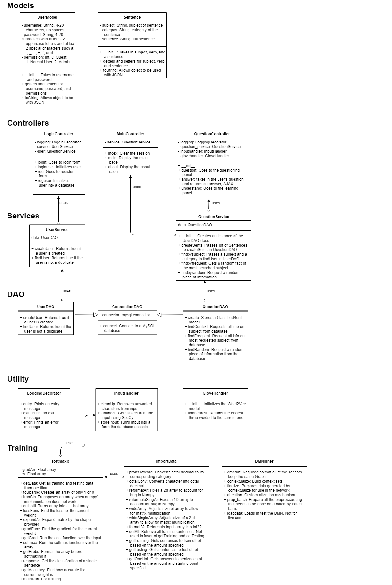
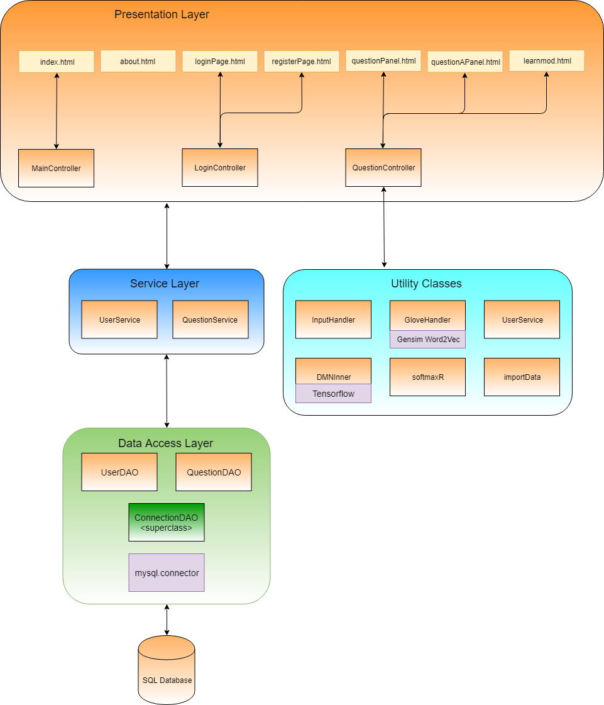
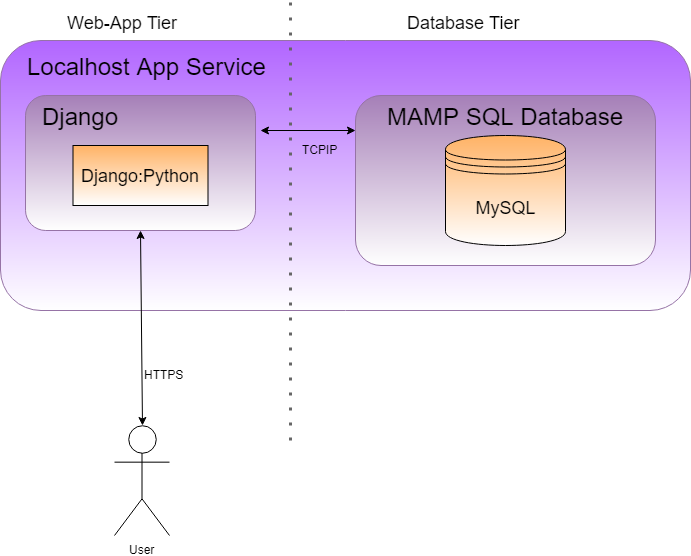
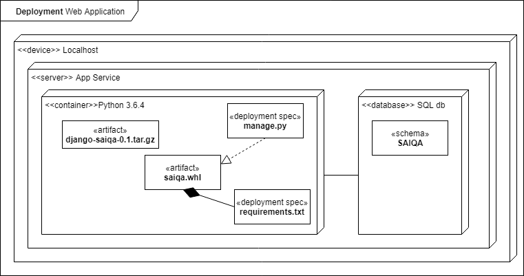
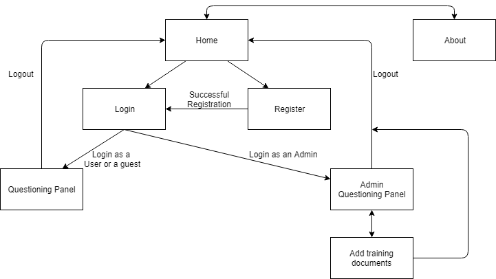

# Abstract

Sima: Artificial Intelligence for Question Answering (further referred to as SAI-QA) is an artificial intelligence that learns information from training documents and uses the data to answer questions provided to it.  This project’s name is derived from the mathematic symbol Sigma since it is only as good as what is available to it, being able to better answer questions the more training documents feed into it.  Its purpose is to aid researchers and student who want to find information without having to spend hours going through documents and websites for a specific piece of information.

## Video Overview

## General Overview

The primary purpose of this project was to combine what I have learned through my major (creating databases, AJAX-enabled web pages, and web applications) and what I have taught myself (Regex, Artificial Intelligence, and Python).  The outcome is a decent web application that can answer questions with relative accuracy if the subject has at least one entry in the database.  Along the way, I also learn about and implemented several artificial intelligence algorithms which will be further talked about.  The main areas of Artificial Intelligence that are used are text analysis and natural language processing (NLP).

### Class Diagram

### Logical Architecture

### Physical Architecture

### Deployment Diagram

### Database

### Sitemap

### Modules
1. [User Module](https://github.com/mark-mo/docs/blob/master/Capstone-SAIQA/docs/UserModule.md)
2. [Learning Module](https://github.com/mark-mo/docs/blob/master/Capstone-SAIQA/docs/LearnModule.md)
3. [Answer Module](https://github.com/mark-mo/docs/blob/master/Capstone-SAIQA/docs/AnswerModule.md)

## Conclusions

Artificial Intelligence is a powerful tool for those who know how to properly use it, something that is not difficult for those with a good mathematic and programming background.  With sites such as Kaggle and companies making their datasets public, most problems can be solved with some form of artificial intelligence without having to create an entire new dataset.

## Future Ideas
- Cross-check to correct data: Compare data to rest of database and remove false information.  False information is information that does not match other information that were found from more trustworthy sources.
- Keep track of unknown subjects: Have a list of all nouns found while learning that are not subject in the database.
- Auto-learn information from unknown nouns: Check the list of unknown nouns for any that are a neighbor to a known subject using Gensim.
- Extract questions from images: Tell the user a fact about one of the objects in an image.

## References
- [Dynamic Memory Network Tutorial](https://github.com/Steven-Hewitt/QA-with-Tensorflow/blob/master/QA%20with%20Tensorflow.ipynb)
- [Softmax Regression Tutorial](https://gist.github.com/awjuliani/5ce098b4b76244b7a9e3#file-softmax-ipynb)