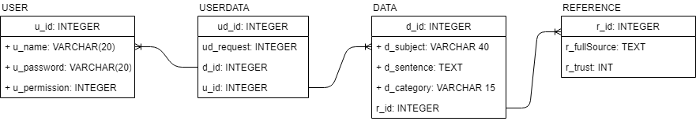

# Abstract

Sima: Artificial Intelligence for Question Answering (further referred to as SAI-QA) is an artificial intelligence that learns information from training documents and uses the data to answer questions provided to it.  This project's name is derived from the mathematic symbol Sigma since it is only as good as what is available to it, being able to better answer questions the more training documents feed into it.  Its purpose is to aid researchers and student who want to find information without having to spend hours going through documents and websites for a specific piece of information.

## Video Overview

## General Overview

The primary purpose of this project was to combine what I have learned through my major (creating databases, AJAX-enabled web pages, and web applications) and what I have taught myself (Regex, Artificial Intelligence, and Python).  The outcome is a decent web application that can answer questions with relative accuracy if the subject has at least one entry in the database.  Along the way, I also [researched](https://github.com/mark-mo/docs/blob/master/Capstone-SAIQA/docs/Research.md) and implemented several artificial intelligence algorithms which will be further talked about.  The main areas of Artificial Intelligence that are used are [text analysis](https://github.com/mark-mo/docs/blob/master/Capstone-SAIQA/docs/Research.md#text-analysis) and [natural language processing (NLP)](https://github.com/mark-mo/docs/blob/master/Capstone-SAIQA/docs/Research.md#natural-language-processing).

### Class Diagram
An overview of all of the classes used for this application can be found [here](https://github.com/mark-mo/docs/blob/master/Capstone-SAIQA/docs/ClassDiagram.md)

### Logical Architecture

This application is a 3-Tier application with Django and several other utility libraries and classes to further aid the application as shown in Figure 1.1.  The Presentation layer contains not only all of the controllers and html pages, it also is the layer that uses Tensorflow and Gensim’s Word2Vec along with an AnnoyIndexer to understand the information that it receives and generate answers. The Data Access layer uses a super class to encapsulate the creation of a database connection using the mysql.connector library to minimize repeating code.  Every class will implement LoggingInterceptor as a decorator so that there is a standardized way to log the flow of the application.  There are also several utility classes that are used in the QuestionController in order to encapsulate functionality.

### Physical Architecture

Due to the size of the models that artificial intelligence this application is a 1-tier application running on a local machine.

### Deployment Diagram

An outline of what artifacts are needed to start up the project.

### Database

A high-level view of the database, showing how the tables relate to each other and what rows there are in each table.

### Sitemap

A high-level overview of the flow of the website.

### Technical Design

A brief overview of the general approach and the main libraries that were leveraged can be found [here](https://github.com/mark-mo/docs/blob/master/Capstone-SAIQA/docs/TechicalDesign.md)

### Modules
1. [User Module](https://github.com/mark-mo/docs/blob/master/Capstone-SAIQA/docs/UserModule.md)
2. [Learning Module](https://github.com/mark-mo/docs/blob/master/Capstone-SAIQA/docs/LearnModule.md)
3. [Answer Module](https://github.com/mark-mo/docs/blob/master/Capstone-SAIQA/docs/AnswerModule.md)

## Conclusions

Artificial Intelligence is a powerful tool for those who know how to properly use it, something that is not difficult for those with a good mathematic and programming background.  With sites such as Kaggle and companies making their datasets public, most problems can be solved with some form of artificial intelligence without having to create an entire new dataset.

## Future Ideas
- Cross-check to correct data: Compare data to rest of database and remove false information.  False information is information that does not match other information that were found from more trustworthy sources.
- Keep track of unknown subjects: Have a list of all nouns found while learning that are not subject in the database.
- Auto-learn information from unknown nouns: Check the list of unknown nouns for any that are a neighbor to a known subject using Gensim.
- Extract questions from images: Tell the user a fact about one of the objects in an image.

## References
- [Dynamic Memory Network Tutorial](https://github.com/Steven-Hewitt/QA-with-Tensorflow/blob/master/QA%20with%20Tensorflow.ipynb)
- [Softmax Regression Tutorial](https://gist.github.com/awjuliani/5ce098b4b76244b7a9e3#file-softmax-ipynb)